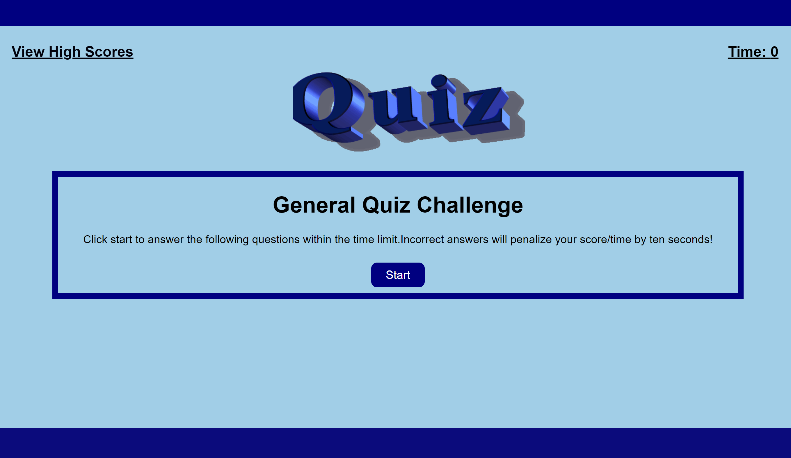
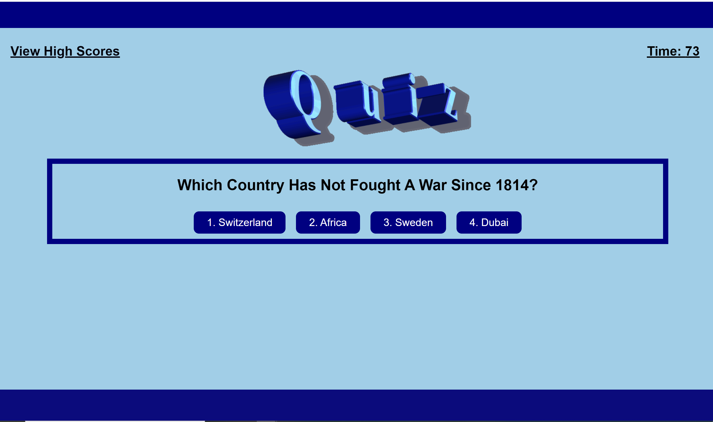
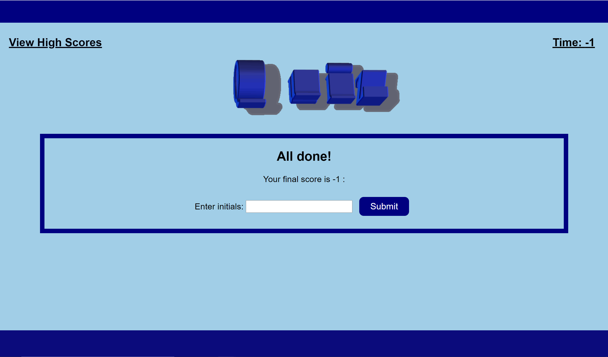
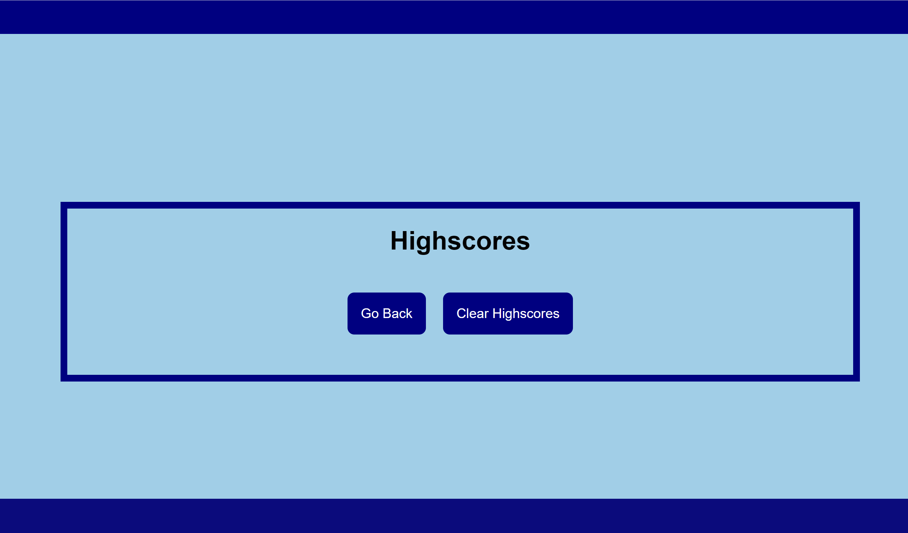

# Web-APIs-Quiz-Project

# :page_with_curl: Descripton
 In this application HTML, CSS, and Javascript documents create a general quiz. This project emphasizes on use of Javascript and Web APIs to make and run a quiz with many questions and setting a timer to make the quiz more challenging. This application is accessible by clicking the deployed link below :point_down::

## :link: Deployed Link:

[Deployed Link](https://shakofa.github.io/Web-APIs-Quiz-Project/.)

## :memo:Features of the web page:
- A start Button
     -  The quiz will start by clicking this button.
- A list of choices buttons for each question
     -  When the quiz start the user will see questions with choices buttons.
     -  By clicking one of these buttons, if the answer is right the user is presented with another question, If not the users recieve a flashing message that says the answer is wrong.
- A Timer
     - The timer starts just when the user click the start button.
- A link at the top left of the page to the Scores page
     -  This links the first page to the scores page .
     -  There are two buttons on scores page:
     - One button clears the scores after the quiz finish.
     - One button takes the user back to the first page.
- A Placeholder and a Submit Button
     - After all questions are answered, it asks the user's initials to show the high scores.
     

 

 

## :open_file_folder: Features of the Appicaion:
- Two HTML Pages
   - index.html
   - highscores.html
- One CSS Page
   - style.css
- Three Javascript Pages
   - logic.js
   - questions.js
   - scores.js
- One README.md File

## :hammer_and_wrench: Tools and Technologies:
- **Languages:** HTML, CSS, JAVASCRIPT
- **Version Control:** Git
- **Editor:** Visual Studio Code
- **Operating System:** Windows 10

 